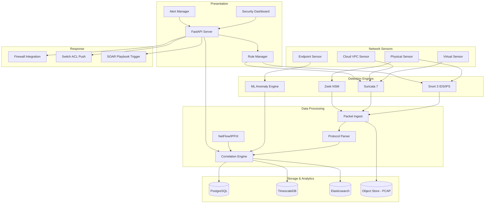

<p align="center">
  
  
  
  
  
  
  
</p>

<p align="center">
  <b>Network Security Monitoring</b><br/>
  IDS/IPS integration, traffic analysis, port scanning detection, flow data, and NetFlow integration.
</p>

---

## 📋 Description

**Kirov Network Defense Platform** is a comprehensive network security monitoring solution that provides real-time visibility into network traffic, intrusion detection and prevention, and advanced threat analytics. It integrates with industry-standard IDS/IPS engines (Snort, Suricata, Zeek), processes NetFlow/IPFIX data for traffic analysis, and uses machine learning for anomaly detection.

The platform ingests traffic from distributed sensors across your network, correlates events with Kirov threat intelligence, and provides SOC analysts with actionable alerts. From port scanning detection to DNS tunneling identification, the Network Defense Platform ensures your network perimeter is continuously monitored against evolving threats.

---

## 🏗️ Architecture



---

## ✨ Key Features

- **🛡️ Multi-Engine IDS/IPS** — Simultaneous Snort 3, Suricata 7, and Zeek analysis with unified alert correlation
- **📊 NetFlow/IPFIX Analytics** — Full flow data collection with bandwidth monitoring, top talkers, and protocol distribution
- **🔍 Protocol Deep Inspection** — HTTP/HTTPS, DNS, SMTP, SSH, TLS, DHCP, SMB, FTP, and 200+ protocol parsers
- **🧠 ML-Based Anomaly Detection** — Unsupervised learning models for baseline profiling, volumetric anomaly detection, and behavioral analysis
- **📈 Traffic Visualization** — Real-time dashboard with throughput graphs, connection maps, and geographic IP visualization
- **🔌 Port Scan Detection** — Stealth scan, SYN scan, FIN scan, NULL scan, Xmas scan, and DNS scan detection heuristics
- **📝 PCAP Storage & Retrieval** — Full packet capture with indexed search, PCAP slicing, and on-demand extraction
- **📋 Custom Rule Management** — Rule creation, testing, staging, and deployment across Snort and Suricata with version control
- **🔗 Threat Intel Correlation** — Real-time matching against threat intelligence feeds for C2 detection, malware traffic, and known bad IPs
- **🌐 Distributed Sensor Management** — Centralized management of 1000s of sensors with automatic configuration and rule sync
- **🚨 Alert Triage** — Priority-based alerting with noise reduction, deduplication, and escalation policies

---

## 🛠️ Tech Stack

| Category | Technology |
|----------|-----------|
| **IDS/IPS Engines** | Snort 3, Suricata 7, Zeek 6 |
| **Backend** | FastAPI 0.110+ (Python 3.11+) |
| **Frontend** | React 18 + TypeScript (Vite) |
| **Time-Series DB** | TimescaleDB |
| **Search** | Elasticsearch 8 |
| **Relational DB** | PostgreSQL 16 |
| **Object Store** | MinIO (S3-compatible) |
| **Message Queue** | Kafka / Redpanda |
| **ML Framework** | scikit-learn, PyTorch (for NIDS-ML) |
| **Flow Data** | NetFlow v5/v9, IPFIX |
| **Packet Capture** | libpcap, n2disk, PF_RING |
| **Containerization** | Docker, Docker Compose, Kubernetes |

---

## 🚀 Quick Start

### Prerequisites

- Python 3.11+, Docker and Docker Compose
- 8GB+ RAM (16GB+ recommended for production sensor)
- Network interface in promiscuous mode (or PCAP replay files)

### Installation

```bash
# Clone the repository
git clone https://github.com/Raphasha27/kirov-network-defense-platform.git
cd kirov-network-defense-platform

# Copy environment configuration
cp .env.example .env
# Edit .env with network interface and sensor settings

# Start core services
docker compose up -d

# Or run locally:
cd server
python -m venv venv
source venv/bin/activate  # Windows: venv\Scripts\activate
pip install -r requirements.txt
uvicorn app.main:app --reload --port 8000
```

### Deploy a Sensor

```bash
# Register a new network sensor
curl -X POST http://localhost:8000/api/v1/sensors \
  -H "Content-Type: application/json" \
  -d '{"name": "core-switch-span", "type": "physical", "interface": "eth0", "location": "Data Center A"}'

# Deploy sensor configuration (run on the sensor machine)
curl -X POST http://localhost:8000/api/v1/sensors/{sensor_id}/deploy
```

### Load IDS Rules

```bash
# Update Snort rules from repository
curl -X POST http://localhost:8000/api/v1/rules/update \
  -H "Content-Type: application/json" \
  -d '{"engine": "snort", "source": "community", "version": "latest"}'

# Test custom rule before deployment
curl -X POST http://localhost:8000/api/v1/rules/test \
  -H "Content-Type: application/json" \
  -d '{"rule": "alert tcp any any -> any 4444 (msg:\"Possible Reverse Shell\"; flow:to_server; classtype:trojan-activity; sid:1000001; rev:1;)"}'
```

---

## 📡 API Overview

| Endpoint | Method | Description |
|----------|--------|-------------|
| `/api/v1/health` | GET | Health check |
| `/api/v1/sensors` | GET/POST | List/register sensors |
| `/api/v1/sensors/:id` | GET/PUT/DELETE | Sensor management |
| `/api/v1/alerts` | GET | List security alerts |
| `/api/v1/alerts/:id` | GET | Alert details and PCAP |
| `/api/v1/alerts/:id/acknowledge` | POST | Acknowledge alert |
| `/api/v1/rules` | GET | List IDS rules |
| `/api/v1/rules` | POST | Create custom rule |
| `/api/v1/rules/:id/deploy` | POST | Deploy rule to sensors |
| `/api/v1/flow/top-talkers` | GET | Top network talkers |
| `/api/v1/flow/protocols` | GET | Protocol distribution |
| `/api/v1/pcap/search` | GET | Search captured packets |
| `/api/v1/pcap/:id/download` | GET | Download PCAP file |

---

## 🔗 Integration with Kirov Ecosystem

| Component | Integration |
|-----------|-------------|
| **[Security Dashboard](https://github.com/Raphasha27/kirov-security-dashboard)** | Network alert visualization and traffic analytics dashboards |
| **[Cyber Automation Engine](https://github.com/Raphasha27/kirov-cyber-automation-engine)** | Automated firewall rule push on IDS alert, IP block playbooks |
| **[Threat Hunter](https://github.com/Raphasha27/kirov-threat-hunter)** | Network IOC correlation with threat hunting campaigns |
| **[Cloud Security Monitor](https://github.com/Raphasha27/kirov-cloud-security-monitor)** | VPC flow log analysis and cloud network security groups |
| **[Malware Analysis Lab](https://github.com/Raphasha27/kirov-malware-analysis-lab)** | Network behavior IOCs from sandbox analysis |

---

## 🔒 Security Considerations

- **Sensor Communication**: All sensor-to-server communication is encrypted via mutual TLS (mTLS) with certificate-based authentication
- **PCAP Access Control**: Packet capture access is restricted by role; raw PCAPs may contain sensitive data and PII
- **Rule Deployment**: Rules are validated in a test environment before production deployment to prevent IPS false positives from disrupting services
- **Sensor Hardening**: Sensors run on minimal-footprint OS images with all non-essential services disabled
- **Encryption at Rest**: PCAP files are encrypted at rest using AES-256; decryption keys managed via vault
- **Network Segmentation**: Management traffic (sensor ↔ server) must be on a dedicated management network separate from monitored traffic

---

## 🗺️ Roadmap

- [ ] **Q3 2026** — Encrypted traffic analysis (TLS fingerprinting, JA3/S, encrypted traffic ML classification)
- [ ] **Q3 2026** — DNS tunneling detection with time-series analysis on query patterns
- [ ] **Q4 2026** — Industrial IoT/SCADA protocol support (Modbus, DNP3, BACnet, IEC 61850)
- [ ] **Q4 2026** — Ransomware network behavior detection (lateral movement, C2 beaconing, mass file encryption)
- [ ] **Q1 2027** — eBPF-based kernel-level sensor for ultra-low-latency packet inspection
- [ ] **Q1 2027** — SDN integration for automated network quarantine via OpenFlow
- [ ] **Q2 2027** — 100Gbps sensor support with AF_XDP and DPDK acceleration

---

## 📄 License

This project is licensed under the **MIT License** — see the [LICENSE](LICENSE) file for details.

## 🙏 Attribution

Created and maintained by **Kirov Security Labs** — the research and development division of Kirov, dedicated to advancing AI-driven cybersecurity solutions.

<p align="center">
  <sub>See every packet. Stop every threat. Defend every bit.</sub>
</p>
